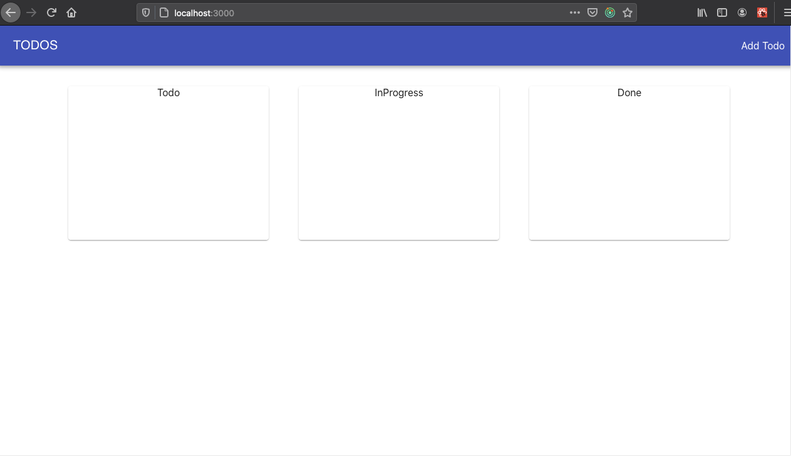
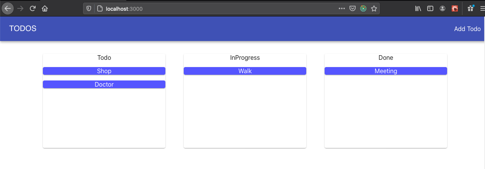
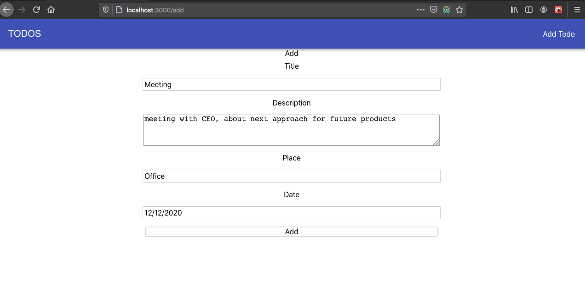
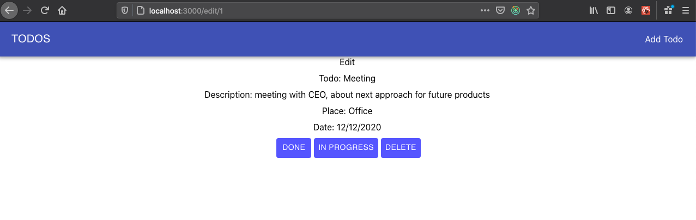

# ToDo List App: https://anto8819.github.io/ToDo-List-App/

## Introduction
In this SPA web page the user can create todos, change the status to "in progress" or "done, and have a list of todos displayed in the home page split by status.

## ReactJS App (Frontend only)

 * Styles in pure CSS and SASS preprocessor
 * Fully responsive
 * Modular code
 * Redux for global state management
 
## Deployment

Check out the full app deployed at https://anto8819.github.io/ToDo-List-App/ .

## Steps to run it locally

First clone the repo in a local directory: $ git clone https://github.com/Anto8819/ToDo-List-App.git

Then, run `npm install` command to install the required dependencies.

Finally, run `npm start` command this will start the local server in port 3000.

Now you can check the app in your browser at http://localhost:3000/

### Home

 

### Home

 

### AddTodo

 

### TodoDetail

 
# ToDo-List-App
